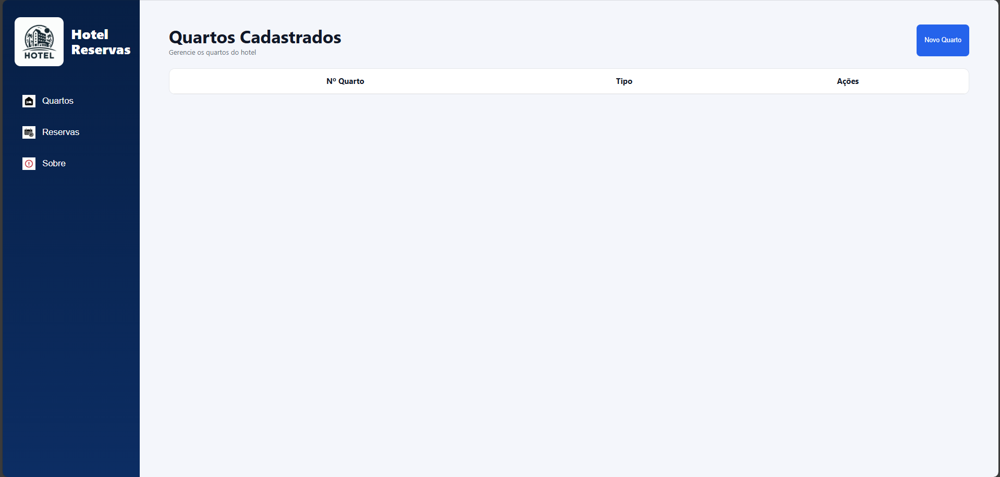
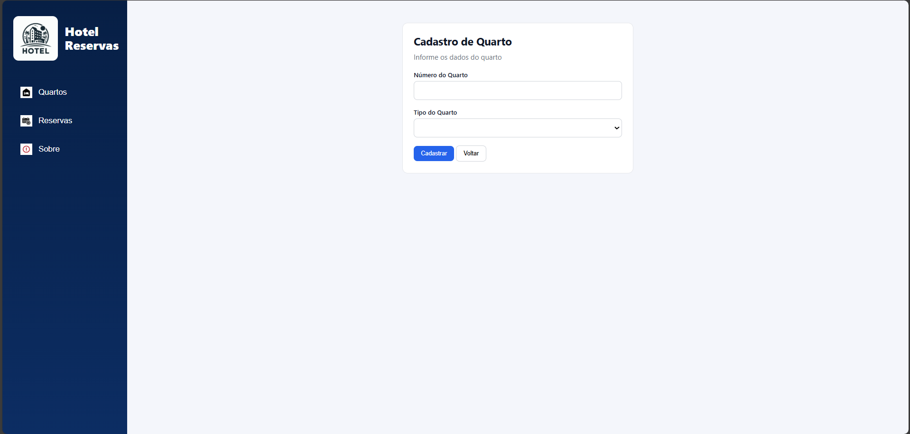

# Hotel Reservas

Sistema web para gerenciamento de quartos e reservas de um hotel. O sistema permite cadastrar, visualizar e excluir quartos, além de gerenciar reservas associadas a cada quarto.

---

# Tecnologias utilizadas

## Front-end
- HTML
- CSS
- JavaScript

## Back-end
- Node.js

## Banco de Dados
- MySQL

## ORM
- Prisma

---

# IDE utilizada

- Visual Studio Code

---

# SGBD

- MySQL

---

# Servidor de aplicação

- Node.js

---

# Prints das telas

Os prints abaixo demonstram o funcionamento do sistema:

## Tela inicial (Quartos cadastrados)
- Exibe a listagem de quartos
- Permite acessar reservas e excluir quartos

---

## Cadastro de quarto
- Adiciona novos quartos

---

# Passo a passo de execução do projeto

## 1. Clonar o repositório

## 2. Instalar dependências do backend

cd api
npm init -y
npm install express cors mysql2 @prisma/client

## 3. Configurar banco de dados

Configurar arquivo .env

## 4. Prisma (configuração do banco)

npx prisma generate
npx prisma migrate dev

## 5. Iniciar servidor backend

npm run dev
